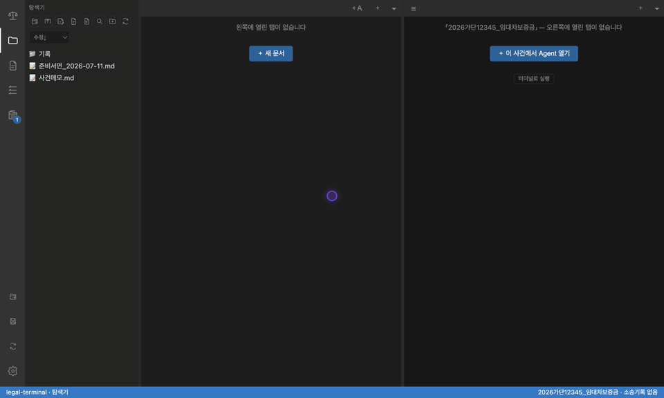
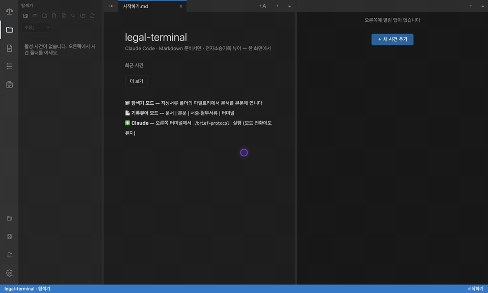
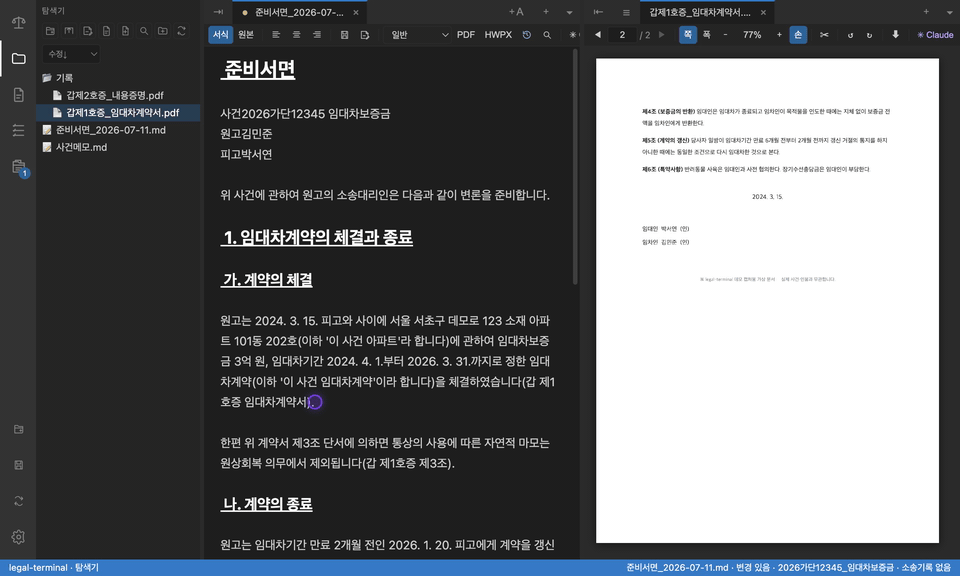
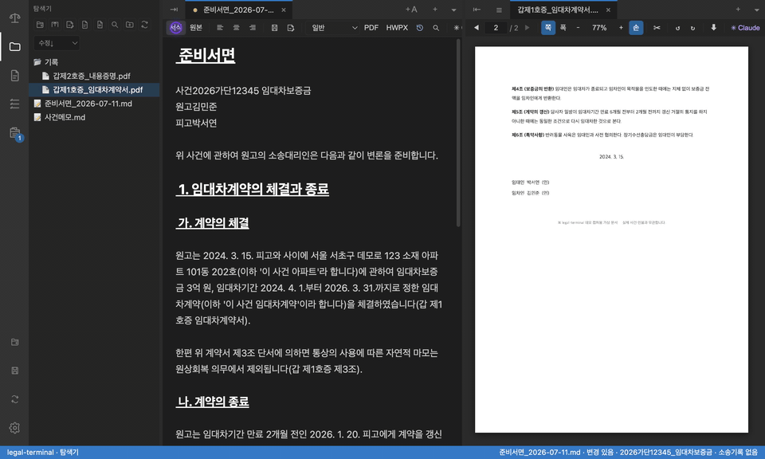
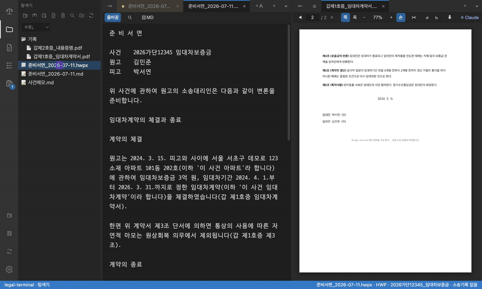

# legal-terminal

> **변호사를 위한 IDE.** 개발자에게 VS Code가 있다면, 송무 변호사에겐 legal-terminal이 있습니다.
> 여기서 IDE 는 *Integrated **Drafting** Environment* — **통합 서면작성 환경**입니다.
> 사건 폴더, 전자소송기록, 준비서면, Claude Code·Codex Agent, JuriSupport 사건 관리를 한 화면에서 다룹니다.
>
> 쥬리서포트 주식회사 ([jurisupport.com](https://jurisupport.com))


<!-- 히어로 영상 교체 방법: screenshots/hero.mp4를 GitHub 웹의 README 편집 화면에 드래그하면
     github.com/user-attachments/assets/... URL이 생긴다. 아래 GIF 줄을 그 URL 한 줄로 바꾸면
     재생/일시정지/탐색이 되는 플레이어로 렌더링된다. -->


legal-terminal은 따로 떠 있던 AI Agent, 터미널, 문서 에디터, 전자소송기록 뷰어, 사건·기일 대시보드를 하나로 묶습니다. 개발자가 IDE 안에서 코드·터미널·디버거를 오가듯, 변호사는 legal-terminal 안에서 **기록을 옆에 띄워 두고 그대로 준비서면을 씁니다.** 기존 `jurisupport-plugins`의 `songmu-legal` 플러그인, korean-law MCP, 판례·법령·사건기록 검색 도구, PII 보호 훅도 Claude에서 그대로 사용할 수 있습니다.

## 화면으로 보기

각 항목을 펼치면 실제 조작 화면이 나옵니다. 모든 장면은 데모용 **가상 사건**(2026가단12345 임대차보증금, 가상 당사자)입니다.

<details>
<summary><b>📂 폴더를 여는 순간 사건 작업환경이 된다</b></summary>
<br>



새 사건 추가 → 작성서류 폴더 선택 한 번이면 끝. 탭 이름과 상태바가 법원·사건번호·사건명 기준으로 정리되고, 탐색기와 Claude가 그 사건 폴더를 기준으로 동작합니다.
</details>

<details>
<summary><b>📑 기록을 옆에 띄우고 그대로 서면을 쓴다</b></summary>
<br>


파일트리에서 서면과 서증 PDF를 열고 탭을 오른쪽 패널로 밀면 좌우 분할. 계약서 조항을 눈으로 확인하면서 준비서면에 바로 이어 씁니다. 별도 PDF 뷰어 창을 오갈 일이 없습니다.
</details>

<details>
<summary><b>✍️ 마크다운인데 화면은 서면처럼 — 라이브 프리뷰</b></summary>
<br>



원본(소스)과 서식(라이브 프리뷰)을 버튼 하나로 전환합니다. 개요 번호·사건표시 캡션이 서면 모양 그대로 보이는 상태에서 편집합니다.
</details>

<details>
<summary><b>📄 클릭 한 번으로 한/글 법원서면(HWPX)</b></summary>
<br>



툴바의 HWPX 버튼을 누르면 md가 한/글 표준 서면 서식(제목 자간, 사건표시 캡션, 개요 번호, 서명 블록)으로 변환됩니다. 내보낸 파일은 앱 안에서 바로 열어 확인할 수 있습니다.
</details>

<details>
<summary><b>🤖 사건 폴더를 아는 Claude/Codex Agent</b></summary>
<br>



`@`로 서면 파일을 첨부해 "보완할 점을 제안해줘"라고 요청하면, 사건 폴더 맥락에서 입증 공백·기재 누락 같은 실무형 피드백이 스트리밍으로 돌아옵니다. 탭마다 Claude 또는 Codex를 고르고, 토큰 사용량과 컨텍스트 잔량도 패널 하단에서 바로 확인합니다.
</details>

## 빠른 설치

Windows:

```powershell
irm https://raw.githubusercontent.com/jurisupport/legal-terminal/main/install.ps1 | iex
```

macOS:

```bash
curl -fsSL https://raw.githubusercontent.com/jurisupport/legal-terminal/main/install-mac.sh | bash
```

직접 내려받기:

- Windows 설치본: [legal-terminal-Setup.exe](https://github.com/jurisupport/legal-terminal/releases/latest/download/legal-terminal-Setup.exe)
- Windows 포터블: [legal-terminal-portable.exe](https://github.com/jurisupport/legal-terminal/releases/latest/download/legal-terminal-portable.exe)
- Mac Apple Silicon: [legal-terminal-mac-arm64.dmg](https://github.com/jurisupport/legal-terminal/releases/latest/download/legal-terminal-mac-arm64.dmg)
- Mac Intel: [legal-terminal-mac-x64.zip](https://github.com/jurisupport/legal-terminal/releases/latest/download/legal-terminal-mac-x64.zip)
- 최신 릴리스: [GitHub Releases](https://github.com/jurisupport/legal-terminal/releases/latest)

기본 Claude Agent를 쓰려면 설치 후 일반 터미널에서 `claude`를 한 번 실행해 로그인합니다. Codex를 쓰려면 Codex CLI를 설치한 뒤 Agent 패널에서 **Codex**를 선택하고 로그인합니다.

## 이번 업데이트

최신 릴리스: [v0.1.194](https://github.com/jurisupport/legal-terminal/releases/tag/v0.1.194)

- **원격 한글 경로 표시 복구**: SSH 서버의 기본 로케일이 `C`여도 폴더 찾기 오류에서 한글 경로가 깨지지 않습니다.
- **목록·검색 처리 통일**: 원격 폴더 목록과 하위 폴더 검색 모두 UTF-8 로케일로 실행합니다.

## 처음 쓰는 순서

1. **legal-terminal 설치**
   - 위의 한 줄 설치 명령 또는 GitHub Release 파일을 사용합니다.

2. **AI Agent 로그인**
   - 한 줄 설치 명령은 Claude Code 설치·업데이트도 안내합니다. 설치 후 터미널에서 `claude`를 실행해 1회 로그인합니다.
   - Codex를 쓸 때는 Codex CLI를 설치하고 Agent 패널의 로그인 버튼으로 인증합니다.

3. **사건 폴더 열기**
   - 좌측 탐색기 또는 새 작업환경 버튼에서 사건의 작성서류 폴더를 선택합니다.
   - 선택한 Agent 탭이 사건 폴더 기준으로 열립니다.

4. **JuriSupport 사건 연동**
   - 앱의 사건 화면에서 JuriSupport 토큰을 붙여넣습니다.
   - 토큰은 JuriSupport 웹 → 프로필 → MCP 연결에서 발급합니다.

5. **원격 사건을 쓰는 경우**
   - 설정에서 SSH 프로필을 추가합니다.
   - 원격 작성서류 루트와 소송기록 루트를 지정합니다.
   - 설정의 **사건 기본 열기**를 원하는 SSH 프로필로 바꿉니다.

## 주요 기능

### 사건 작업환경

- 사건 1개를 Agent 탭 또는 터미널 탭으로 열어 Claude Code나 Codex와 함께 작업합니다.
- 탭 이름은 법원, 사건번호, 사건명, 당사자 정보를 바탕으로 자동 정리됩니다.
- 작업환경 저장/복원으로 열린 문서, 터미널, 좌우 패널, 현재 사건, PDF 보기 상태를 다시 불러올 수 있습니다.
- 문서와 터미널은 좌우 패널 사이를 옮길 수 있고, 탭을 새 창으로 떼어낼 수 있습니다.

### Agent Panel과 터미널

- 기본 작업은 **Agent Panel**에서 진행합니다. Claude/Codex의 메시지, 작업 과정, 권한 요청, 선택 질문, diff를 UI로 나누어 보여줍니다.
- 탭마다 Claude 또는 Codex를 선택하고 모델·추론 정도를 바꿀 수 있습니다. 대화 중 Agent를 바꾸면 기존 맥락을 새 탭으로 넘깁니다.
- `@` 파일 첨부와 `/` 명령 자동완성, 사용량·진행 상태 표시를 지원합니다.
- 기존 PTY 터미널과 저장된 Agent 세션 이어하기도 사용할 수 있습니다.
- 작업 중, 완료, 질문 대기 상태가 탭에 표시되고 알림음과 창 주의 요청을 지원합니다.

### 문서와 기록

- Markdown 에디터는 라이브 프리뷰, 표 편집, PDF/HWPX 내보내기를 지원합니다.
- 파일 뷰어는 PDF, 이미지, HWP/HWPX 텍스트, DOCX 텍스트, CSV, Markdown/MDX, HTML을 다룹니다.
- 전자소송기록 PDF는 문서, 서증, 첨부서류로 자동 분류해 탐색할 수 있습니다.
- 탐색기와 기록뷰어의 파일을 Agent 탭으로 드래그하면 해당 파일을 바탕으로 질문할 수 있습니다.

### 사건 대시보드

- JuriSupport 사건, 기일, 당사자 정보를 앱 안에서 조회합니다.
- 좌측 **다가오는 기일** 패널에서 임박 기일을 날짜순으로 봅니다.
- 사건 카드, 다가오는 기일, 할일 카드 클릭은 설정의 **사건 기본 열기**를 따릅니다.
- 사건 우클릭 메뉴에서 로컬 열기, SSH 프로필별 열기, Claude 브리핑, JuriSupport 웹 열기, 복사를 실행합니다.
- 다가오는 기일 우클릭 메뉴에서 해당 사건의 기일 준비 할일을 바로 만듭니다.
- 사건별 Agent 작업 이력과 최근 활동을 타임라인으로 확인합니다.

### 원격 작업 (SSH)

- 원격 Mac/Linux의 사건 폴더를 로컬처럼 열 수 있습니다.
- 원격 사건에서는 선택한 Claude Code 또는 Codex CLI가 해당 서버에서 실행되고, 탐색기·뷰어·에디터는 SFTP로 원격 파일을 직접 다룹니다.
- 설정에 SSH 프로필, 원격 작성서류 루트, 원격 소송기록 루트, 빠른 시작 경로를 저장할 수 있습니다.
- 원격 폴더 선택창에서 하위 폴더 검색, 새 폴더 생성, OneDrive 최신화를 사용할 수 있습니다.
- 원격 OneDrive 파일이 클라우드 전용 상태이면 rclone으로 실체화한 뒤 열람합니다.
- 파일 패널과 동기화는 키 또는 ssh-agent 인증을 사용합니다. 비밀번호 인증은 원격 터미널 접속에서만 기대할 수 있습니다.

## 설치 상세

### Windows

PowerShell을 열고 아래 명령을 실행합니다.

```powershell
irm https://raw.githubusercontent.com/jurisupport/legal-terminal/main/install.ps1 | iex
```

회사 보안 정책 때문에 한 줄 실행이 막히면 파일로 저장해 확인한 뒤 실행할 수 있습니다.

```powershell
$installer = "$env:TEMP\legal-terminal-install.ps1"
iwr https://raw.githubusercontent.com/jurisupport/legal-terminal/main/install.ps1 -UseBasicParsing -OutFile $installer
notepad $installer
powershell -NoProfile -ExecutionPolicy Bypass -File $installer
```

설치 파일 실행 중 "Windows의 PC 보호" 창이 뜨면 **추가 정보** → **실행**을 누릅니다. 그래도 막히면 받은 `.exe`를 우클릭 → 속성 → **차단 해제** 후 다시 실행합니다.

### macOS

터미널을 열고 아래 명령을 실행합니다.

```bash
curl -fsSL https://raw.githubusercontent.com/jurisupport/legal-terminal/main/install-mac.sh | bash
```

아직 코드서명/공증 전 빌드라서 Gatekeeper가 앱을 막을 수 있습니다. "손상되었기 때문에 휴지통으로 이동" 경고가 뜨면 앱 위치에 맞춰 격리 속성을 지운 뒤 Finder에서 우클릭 → 열기로 실행합니다.

```bash
# /Applications에 설치한 경우
xattr -dr com.apple.quarantine /Applications/legal-terminal.app

# Downloads에서 압축을 풀고 바로 실행하는 경우
xattr -dr com.apple.quarantine ~/Downloads/legal-terminal.app
```

## jurisupport-plugins와 함께 사용

legal-terminal은 실제 `claude` CLI를 실행합니다. [`jurisupport-plugins`](https://github.com/jurisupport/jurisupport-plugins)를 설치해 두면 플러그인, 스킬, MCP, 훅이 앱 안의 Claude에서도 그대로 동작합니다.

설치 후 사용할 수 있는 대표 기능:

- `songmu-legal` 플러그인: `/brief-protocol`, `/cold-start-interview`, `case-index`
- 검색 스킬: 법고을 판례검색, 과거 사건기록, 법률서적, lbox 가이드
- `korean-law` MCP
- PII 차단 훅

사건 대시보드의 JuriSupport 토큰 연동은 위 플러그인 설치와 별개입니다. 사건·기일·당사자 대시보드를 쓰려면 앱의 사건 화면에서 JuriSupport MCP 토큰을 따로 연결합니다.

## 개발

### 문서 변환 규칙

- Markdown을 HWPX로 내보낼 때는 DOCX/PDF 등 중간 포맷을 거치지 않고 HWPX(OWPML) ZIP/XML을 직접 생성합니다.
- Markdown 제목(`#`부터 `######`)은 HWPX 개요 레벨 1-6으로 매핑합니다.

```bash
npm ci
npm run dev        # 개발 모드
npm run typecheck  # 타입 검사
npm run build      # 프로덕션 빌드(out/)
npm run preview    # 빌드 결과 실행
npm run dist:mac   # macOS dmg/zip 패키징
npm run dist:win   # Windows nsis/portable 패키징
```

`@lydell/node-pty`는 prebuilt N-API라 일반적인 macOS/Windows 개발 환경에서는 별도 컴파일러 없이 설치됩니다.

### 데모 GIF 재생성

README의 "화면으로 보기" GIF와 `screenshots/hero.mp4`는 스크립트로 다시 만듭니다. Playwright가 dev 인스턴스를 띄워 가상 사건(`scripts/demo-fixtures/`)만 조작하며, 화면의 실사용 데이터(최근 사건·SSH 프로필·홈 경로)는 가린 채 녹화합니다. 샘플 PDF가 없으면 자동 생성하고, 끝나면 cases.json/세션 인덱스의 데모 흔적을 지웁니다.

```bash
npm run build
node scripts/capture-demos.mjs              # 전체 (agent 장면은 실제 Claude 호출)
node scripts/capture-demos.mjs --skip-agent # Claude 호출 없이
node scripts/capture-demos.mjs --only hwpx-export,live-preview
```

릴리스 배포는 `v*` 태그 푸시로 GitHub Actions의 `Build & Release` 워크플로우가 실행됩니다.

## 기술 스택

Electron 42, electron-vite, React 18, TypeScript, xterm.js, `@lydell/node-pty`, `ssh2`, 시스템 OpenSSH, rclone, pdf.js, CodeMirror 6, marked/DOMPurify, hwp.js, D2Coding 번들 폰트.

## 라이선스

MIT
