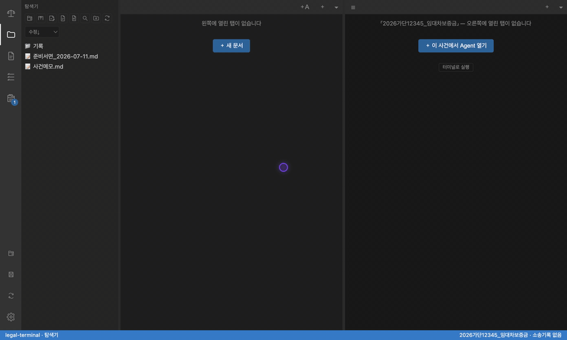
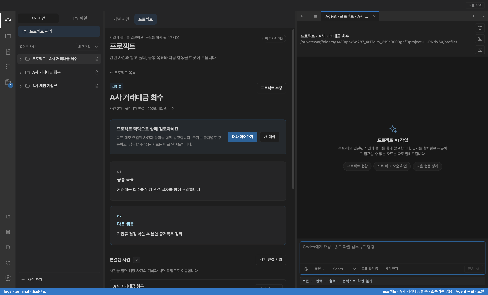
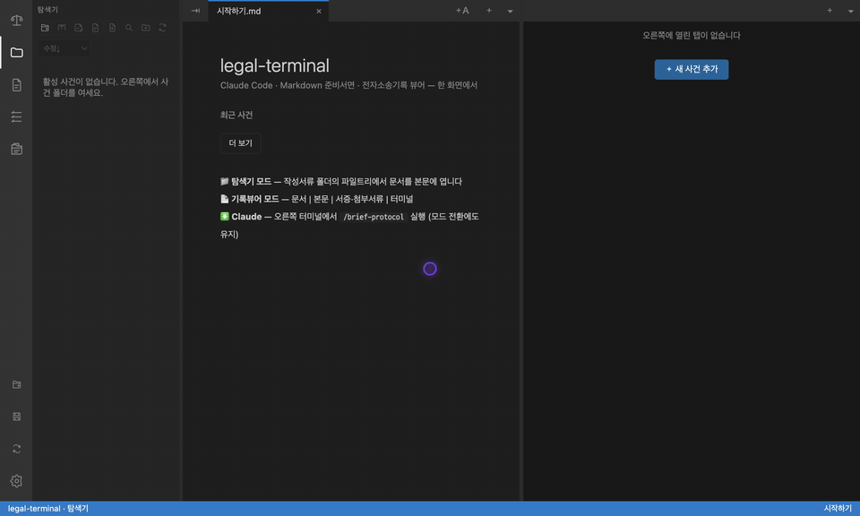
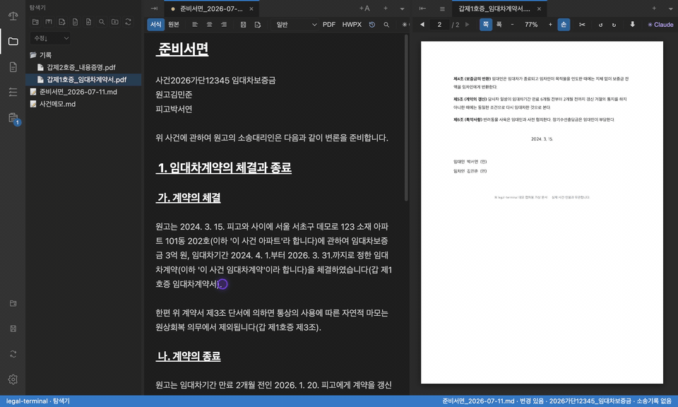
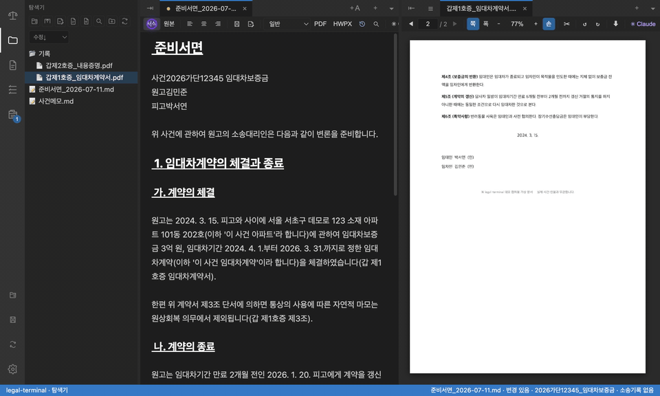
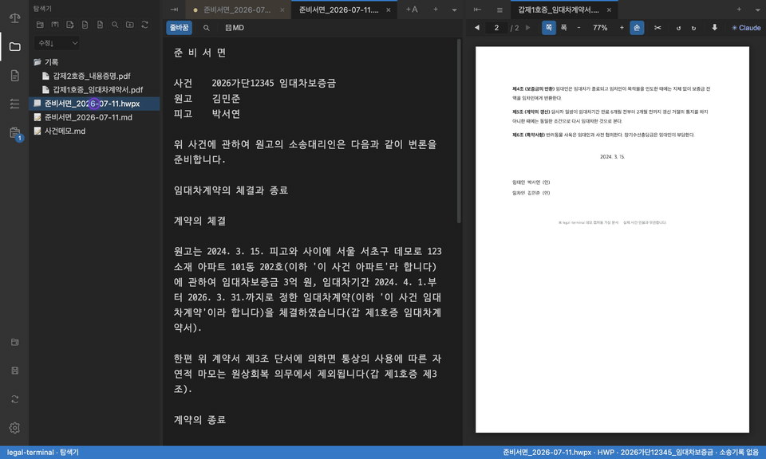

# legal-terminal

> **변호사를 위한 사건·프로젝트 작업환경.** 기록을 읽고, AI와 검토하고, 서면을 작성하는 일을 한 화면에서 이어갑니다.
> 여기서 IDE 는 *Integrated **Drafting** Environment* — **통합 서면작성 환경**입니다.
> 사건 하나의 기록 검토부터 여러 사건과 참고 폴더를 묶은 프로젝트까지, Claude·Codex와 함께 작업합니다.
>
> 쥬리서포트 주식회사 ([jurisupport.com](https://jurisupport.com))


<!-- 히어로 영상 교체 방법: screenshots/hero.mp4를 GitHub 웹의 README 편집 화면에 드래그하면
     github.com/user-attachments/assets/... URL이 생긴다. 아래 GIF 줄을 그 URL 한 줄로 바꾸면
     재생/일시정지/탐색이 되는 플레이어로 렌더링된다. -->


legal-terminal은 사건 폴더, 전자소송기록 뷰어, 문서 에디터, AI Agent, 사건·기일·할일 화면을 연결합니다. **기록을 옆에 띄워 서면을 쓰고, 관련 사건과 공통 자료는 프로젝트로 묶어 검토할 수 있습니다.**

| 작업 방식 | 이런 때 사용합니다 | 시작 위치 |
| --- | --- | --- |
| **개별 사건** | 한 사건의 기록을 검토하고 서면을 작성할 때 | **사건 추가** 또는 사건 목록 |
| **프로젝트** | 관련 사건과 공통 자료를 하나의 목표 아래 함께 검토할 때 | **프로젝트 관리** |

프로젝트에는 사건과 로컬·SSH 참고 폴더를 함께 연결할 수 있습니다. **사건 없이 자료 폴더만 연결한 프로젝트**도 만들 수 있습니다.

[빠른 설치](#빠른-설치) · [처음 쓰는 순서](#처음-쓰는-순서) · [프로젝트 사용법](#프로젝트로-함께-작업하기) · [v0.1.257 주요 변경](#이번-업데이트)

## 빠른 설치

Windows:

```powershell
irm https://github.com/jurisupport/legal-terminal/releases/latest/download/install.ps1 | iex
```

macOS:

```bash
curl -fsSL https://github.com/jurisupport/legal-terminal/releases/latest/download/install-mac.sh | bash
```

직접 내려받기:

- Windows 설치본: [legal-terminal-Setup.exe](https://github.com/jurisupport/legal-terminal/releases/latest/download/legal-terminal-Setup.exe)
- Windows 포터블: [legal-terminal-portable.exe](https://github.com/jurisupport/legal-terminal/releases/latest/download/legal-terminal-portable.exe)
- Mac Apple Silicon: [legal-terminal-mac-arm64.dmg](https://github.com/jurisupport/legal-terminal/releases/latest/download/legal-terminal-mac-arm64.dmg)
- Mac Intel: [legal-terminal-mac-x64.zip](https://github.com/jurisupport/legal-terminal/releases/latest/download/legal-terminal-mac-x64.zip)
- 최신 릴리스: [GitHub Releases](https://github.com/jurisupport/legal-terminal/releases/latest)

## 처음 쓰는 순서

1. **앱을 설치하고 준비 상태를 확인합니다.** 시작하기 화면에서 도구 설치·로그인·연결 상태를 확인합니다. 필요한 설치·연결 명령을 복사해 이 컴퓨터의 터미널에서 실행할 수 있습니다.
2. **사용할 AI에 로그인합니다.** Claude는 설치 후 `claude`를 한 번 실행해 로그인합니다. Codex를 사용하려면 Codex CLI를 설치하고 Agent 패널에서 **Codex**를 선택해 로그인합니다.
3. **작업 범위를 선택합니다.** 개별 사건은 **사건 추가**로 작성서류 폴더를 열고 **새 작업**에서 AI 대화를 시작합니다. 여러 사건·자료를 함께 다루려면 **프로젝트 관리**에서 프로젝트를 만듭니다.
4. **필요한 자료로 질문하고 결과를 이어서 작업합니다.** `@`로 파일을 첨부하거나 문서의 선택 부분을 인용해 질문할 수 있습니다. 작성한 Markdown 서면은 PDF·HWPX로 내보낼 수 있습니다.

JuriSupport에 연결하면 등록된 사건·기일·당사자·할일을 가져옵니다. Claude Code·Codex에 JuriSupport MCP 토큰을 이미 등록했다면 앱에서 재사용하며, 처음 연결하는 경우 앱의 사건 화면에서 토큰을 입력합니다. 로컬 폴더와 프로젝트 작업에는 JuriSupport 연동이 필수는 아닙니다.

원격 사건을 쓰려면 설정에서 SSH 프로필과 작성서류·소송기록 루트를 지정하고 **사건 기본 열기**를 선택하세요.

## 프로젝트로 함께 작업하기

프로젝트는 **하나의 업무 목표를 위해 관련 사건과 공통 자료·판단을 함께 관리하는 공간**입니다. 각 사건의 기록과 서면은 개별 사건 작업환경에서 계속 다룹니다.

### 만들고 시작하기

1. 사이드바에서 **프로젝트 관리 → 새 프로젝트**를 선택합니다.
2. 프로젝트 이름과 **공통 목표**, **다음 행동**을 적습니다.
3. 함께 다룰 사건을 선택하고 **폴더 추가**로 로컬·SSH 참고 폴더를 연결합니다.
4. 저장한 뒤 **프로젝트 AI 작업**을 누릅니다.
5. 이후에는 **대화 이어가기**로 기존 작업을 잇거나, **새 대화**로 같은 프로젝트 범위의 별도 대화를 시작합니다.



*가상 사건과 자료로 구성한 프로젝트 작업 화면입니다.*

### 사용 예시

**‘A사 거래대금 회수’** 프로젝트에 대금청구·가압류 사건과 계약서·거래명세·입금내역 폴더를 연결했다고 가정해 보겠습니다.

> 연결된 사건과 입금내역에서 다르게 적힌 금액과 날짜를 찾아줘. 어느 자료의 어떤 부분을 근거로 했는지 구분하고, 확인하지 못한 자료도 알려줘.

AI에는 매 요청마다 최신 목표·메모와 연결 자료 목록이 전달됩니다. 필요한 자료를 검색·열람하고 사건·폴더별 출처를 구분할 수 있습니다. 판단이나 진행 사항을 **공통 메모에 기록해 달라**고 요청하면 출처와 함께 저장하고 **다음 행동**도 갱신할 수 있습니다. 기록 변경은 현재 Agent 권한 설정을 따릅니다.

공통 배경을 매번 다시 설명하는 부담을 줄이고, 사건 사이의 차이와 후속 작업을 같은 프로젝트에서 이어서 검토하는 데 활용합니다. 연결만으로 모든 자료를 미리 읽거나 내용을 자동으로 확정하는 기능은 아닙니다.

### 현재 지원 범위

| 항목 | 지원 범위 |
| --- | --- |
| 연결 자료 | 로컬·SSH 사건 폴더, 별도의 참고 폴더, JuriSupport에 등록된 사건 |
| 본문 조회 | PDF, HWP/HWPX, DOCX, 텍스트 자료 |
| 조회 한도 | 파일당 10MB, 추출 본문 20만 자, PDF 앞 100쪽 |
| 검색 | 파일 수·탐색 깊이 제한이 있으며 생략 여부와 접근 실패를 결과에 표시 |
| 이미지 전용 문서 | 프로젝트 본문 조회에 사용하려면 별도 OCR 필요 |
| 저장·실행 | 프로젝트와 대화는 현재 기기에 저장. 프로젝트 AI는 이 컴퓨터에서 실행하고 SSH 자료는 앱을 통해 조회 |
| 기기 간 프로젝트 동기화 | 현재 미지원 |

위 한도는 **프로젝트 AI의 자료 조회 도구**에 적용됩니다. 대용량 기록은 필요한 부분을 나누어 연결해 주세요. 새 산출물은 프로젝트 전용 작업 폴더에 저장됩니다. 프로젝트 삭제나 연결 해제는 연결한 사건·폴더의 원본 파일을 삭제하지 않습니다.

## 주요 기능

### 사건 작업환경

- 사건 하나를 Agent 탭 또는 터미널 탭으로 열어 Claude·Codex와 함께 작업합니다.
- 사이드바에서 열어본 사건과 최근 대화를 찾고, 작업 중·확인 대기·완료 상태를 확인합니다.
- 탭 이름은 법원, 사건번호, 사건명, 당사자 정보를 바탕으로 자동 정리됩니다.
- 작업환경 저장/복원으로 열린 문서, 터미널, 좌우 패널, 현재 사건, PDF 보기 상태를 다시 불러올 수 있습니다.
- 문서와 터미널은 좌우 패널 사이를 옮길 수 있고, 탭을 새 창으로 떼어낼 수 있습니다.

### Agent Panel과 터미널

- 기본 작업은 **Agent Panel**에서 진행합니다. Claude/Codex의 메시지, 작업 과정, 권한 요청, 선택 질문, diff를 UI로 나누어 보여줍니다.
- 탭마다 Claude 또는 Codex를 선택하고 모델·추론 정도를 바꿀 수 있습니다. 대화 중 Agent를 바꾸면 기존 맥락을 새 탭으로 넘깁니다.
- `@` 파일 첨부와 `/` 명령 자동완성, 사용량·진행 상태 표시를 지원합니다.
- 기존 PTY 터미널과 저장된 Agent 세션 이어하기도 사용할 수 있습니다.
- **원격 Agent 작업 유지**: SSH로 실행한 Claude·Codex Agent는 노트북을 닫거나 앱·탭을 닫아도 원격 컴퓨터에서 계속 작업합니다. 앱을 다시 열면 기존 작업과 놓친 출력을 불러오고, 승인·질문은 응답할 때까지 기다립니다. 작업을 취소하려면 **중단**을 누릅니다.
- 이 기능은 **Agent 패널**에 적용됩니다. 원격 컴퓨터는 켜져 있어야 하며 Python 3가 필요합니다. 아직 전송하지 않은 대기 지시는 앱이 켜져 있을 때 전송됩니다. 원격 실행 기록은 원격 사용자 계정의 `~/.legal-terminal/agent-runs`에 보관됩니다.
- 작업 중, 완료, 질문 대기 상태가 탭에 표시되고 알림음과 창 주의 요청을 지원합니다.

### 문서와 기록

- Markdown 에디터는 라이브 프리뷰, 표 편집, PDF/HWPX 내보내기를 지원합니다.
- 파일 뷰어는 PDF, 이미지, HWP/HWPX 텍스트, DOCX 텍스트, CSV, Markdown/MDX, HTML을 다룹니다.
- 문서의 선택 부분을 인용하고 짧은 지시를 입력해 AI와 검토할 수 있습니다.
- 영상·음성을 재생하고, 선택한 시간 구간이나 영상 화면 캡처를 AI 질문에 첨부할 수 있습니다.
- 전자소송기록 PDF는 문서, 서증, 첨부서류로 자동 분류해 탐색할 수 있습니다.
- 탐색기와 기록뷰어의 파일을 Agent 탭으로 드래그하면 해당 파일을 바탕으로 질문할 수 있습니다.

### 사건 대시보드

- JuriSupport 사건, 기일, 당사자 정보를 앱 안에서 조회합니다.
- 좌측 **다가오는 기일** 패널에서 임박 기일을 날짜순으로 봅니다.
- 사건 카드, 다가오는 기일, 할일 카드 클릭은 설정의 **사건 기본 열기**를 따릅니다.
- 사건 우클릭 메뉴에서 로컬 열기, SSH 프로필별 열기, Claude 브리핑, JuriSupport 웹 열기, 복사를 실행합니다.
- 다가오는 기일 우클릭 메뉴에서 해당 사건의 기일 준비 할일을 바로 만듭니다.
- 사건별 Agent 작업 이력과 최근 활동을 타임라인으로 확인합니다.

### 원격 작업 (SSH)

- 원격 Mac/Linux의 사건 폴더를 로컬처럼 열 수 있습니다.
- 원격 사건에서는 선택한 Claude Code 또는 Codex CLI가 해당 서버에서 실행되고, 탐색기·뷰어·에디터는 SFTP로 원격 파일을 직접 다룹니다.
- 설정에 SSH 프로필, 원격 작성서류 루트, 원격 소송기록 루트, 빠른 시작 경로를 저장할 수 있습니다.
- 원격 폴더 선택창에서 하위 폴더 검색, 새 폴더 생성, OneDrive 최신화를 사용할 수 있습니다.
- 원격 OneDrive 파일이 클라우드 전용 상태이면 rclone으로 실체화한 뒤 열람합니다.
- 파일 패널과 동기화는 키 또는 ssh-agent 인증을 사용합니다. 비밀번호 인증은 원격 터미널 접속에서만 기대할 수 있습니다.
- 같은 서버·사용자 계정에 연결한 컴퓨터끼리는 열린 사건과 AI 대화 탭을 자동으로 이어 엽니다. 앱 시작·창 복귀·연결 복구 때 확인하며, 사용 중에는 30초마다 새 탭을 가져옵니다. 각 컴퓨터의 SSH 프로필 이름이 달라도 됩니다.
- 기존 PC를 열어둔 상태에서도 다른 PC에서 닫은 사건·대화를 오래된 자동 저장이 다시 열지 않습니다. 미저장 문서·작성 중인 질문·실행 중인 작업은 해당 PC에 남겨두며, 사용자가 직접 다시 열면 공유 상태에도 반영합니다. 두 컴퓨터 모두 이 기능이 포함된 앱을 사용해야 합니다.
- 같은 AI 대화를 앱에서 동시에 실행하려 하면 두 번째 요청에 실행 중임을 안내합니다. 서버의 Python 3 표준 기능으로 실제 실행이 끝날 때까지 보호하며, 연결이 끊겼다는 이유로 실행 중인 잠금을 풀지 않습니다. Codex 실행은 이 보호를 위해 전용 연결을 사용하므로 공식 원격제어 화면에는 연결되지 않습니다.
- 자동 이어가기는 최신 사건·대화 상태를 공유하며, 수동 작업환경 스냅샷은 특정 시점의 문서·탭 배치를 복원하는 용도로 유지됩니다. 과거 스냅샷은 자동으로 열지 않습니다. 자동 공유에는 문서 배치·미저장 문서·실행 중인 AI 작업의 실시간 화면은 포함되지 않습니다.

## 화면으로 보기

각 항목을 펼치면 개별 사건의 기록 검토·서면 작성 흐름을 볼 수 있습니다. 아래 GIF는 데모용 **가상 사건**(2026가단12345 임대차보증금, 가상 당사자)으로 촬영했습니다.

<details>
<summary><b>📂 폴더를 여는 순간 사건 작업환경이 된다</b></summary>
<br>



새 사건 추가 → 작성서류 폴더 선택 한 번이면 끝. 탭 이름과 상태바가 법원·사건번호·사건명 기준으로 정리되고, 탐색기와 Claude가 그 사건 폴더를 기준으로 동작합니다.
</details>

<details>
<summary><b>📑 기록을 옆에 띄우고 그대로 서면을 쓴다</b></summary>
<br>


파일트리에서 서면과 서증 PDF를 열고 탭을 오른쪽 패널로 밀면 좌우 분할. 계약서 조항을 눈으로 확인하면서 준비서면에 바로 이어 씁니다. 별도 PDF 뷰어 창을 오갈 일이 없습니다.
</details>

<details>
<summary><b>✍️ 마크다운인데 화면은 서면처럼 — 라이브 프리뷰</b></summary>
<br>



원본(소스)과 서식(라이브 프리뷰)을 버튼 하나로 전환합니다. 개요 번호·사건표시 캡션이 서면 모양 그대로 보이는 상태에서 편집합니다.
</details>

<details>
<summary><b>📄 클릭 한 번으로 한/글 법원서면(HWPX)</b></summary>
<br>



툴바의 HWPX 버튼을 누르면 md가 한/글 표준 서면 서식(제목 자간, 사건표시 캡션, 개요 번호, 서명 블록)으로 변환됩니다. 내보낸 파일은 앱 안에서 바로 열어 확인할 수 있습니다.
</details>

<details>
<summary><b>🤖 사건 폴더를 아는 Claude/Codex Agent</b></summary>
<br>



`@`로 서면 파일을 첨부해 "보완할 점을 제안해줘"라고 요청하면, 사건 폴더 맥락에서 입증 공백·기재 누락 같은 실무형 피드백이 스트리밍으로 돌아옵니다. 탭마다 Claude 또는 Codex를 고르고, 토큰 사용량과 컨텍스트 잔량도 패널 하단에서 바로 확인합니다.
</details>

## 이번 업데이트

최신 릴리스: [v0.1.257](https://github.com/jurisupport/legal-terminal/releases/tag/v0.1.257)

- **Claude 로그인 복구**: 프로젝트 등 로컬 Agent에서도 로그인 상태를 확인하고 앱 안에서 다시 로그인할 수 있습니다. 인증이 만료되면 대기 요청을 보류하며, 로그인 완료 후 이어서 처리합니다. 이미 실패한 요청은 자동 재전송하지 않습니다.

- **새 Agent 첫 질문 중복 표시 수정**: 새 대화의 첫 질문을 과거 기록에서 다시 불러오지 않도록 했습니다. 기존 원격 대화 복원과 같은 질문을 다시 보내는 동작은 유지합니다.
- **폰 작업 이어가기**: 폰에서 저장한 작업을 열어본 사건 목록에 표시하고, 생성 기기가 기록된 대화에는 `폰` 표시를 유지합니다.
- **HTML 인용 버튼**: 문서 안으로 포커스가 이동해도 드래그를 마칠 때까지 인용 버튼을 숨겨 선택 도중 잘못된 위치에 뜨지 않도록 했습니다.

- **프로젝트와 AI 작업**: 여러 사건과 로컬·SSH 참고 폴더를 한 프로젝트에 연결하고, 공통 목표·메모를 참고하는 Claude·Codex 대화를 시작하거나 이어갑니다.
- **사건별 작업 탐색**: 사이드바에서 열어본 사건과 최근 대화를 찾아 이어가고, 확인 대기·완료 상태를 확인합니다.
- **파일 드래그와 원격 저장 보완**: 파일 탐색기의 드래그 동작, 원격 저장 충돌·끊김 처리, 미디어 캐시 활용과 컨텍스트 표시를 개선했습니다.
- **시작 준비 안내**: 설치·로그인·연결 상태를 시작 화면에서 확인하고, 이미 등록된 JuriSupport 연결 키를 재사용합니다. 계정이 변경되면 이전 요청을 중단하고 새로 조회합니다.

## 설치 상세

### Windows

PowerShell을 열고 아래 명령을 실행합니다.

```powershell
irm https://github.com/jurisupport/legal-terminal/releases/latest/download/install.ps1 | iex
```

회사 보안 정책 때문에 한 줄 실행이 막히면 파일로 저장해 확인한 뒤 실행할 수 있습니다.

```powershell
$installer = "$env:TEMP\legal-terminal-install.ps1"
iwr https://github.com/jurisupport/legal-terminal/releases/latest/download/install-windows.ps1 -UseBasicParsing -OutFile $installer
notepad $installer
powershell -NoProfile -ExecutionPolicy Bypass -File $installer
```

설치 파일 실행 중 "Windows의 PC 보호" 창이 뜨면 **추가 정보** → **실행**을 누릅니다. 그래도 막히면 받은 `.exe`를 우클릭 → 속성 → **차단 해제** 후 다시 실행합니다.

### macOS

터미널을 열고 아래 명령을 실행합니다.

```bash
curl -fsSL https://github.com/jurisupport/legal-terminal/releases/latest/download/install-mac.sh | bash
```

아직 코드서명/공증 전 빌드라서 Gatekeeper가 앱을 막을 수 있습니다. "손상되었기 때문에 휴지통으로 이동" 경고가 뜨면 앱 위치에 맞춰 격리 속성을 지운 뒤 Finder에서 우클릭 → 열기로 실행합니다.

```bash
# /Applications에 설치한 경우
xattr -dr com.apple.quarantine /Applications/legal-terminal.app

# Downloads에서 압축을 풀고 바로 실행하는 경우
xattr -dr com.apple.quarantine ~/Downloads/legal-terminal.app
```

## jurisupport-plugins와 함께 사용

legal-terminal의 Claude Agent는 Claude Code 기반으로 동작합니다. [`jurisupport-plugins`](https://github.com/jurisupport/jurisupport-plugins)를 설치해 두면 플러그인, 스킬, MCP, 훅이 앱 안의 Claude에서도 그대로 동작합니다.

설치 후 사용할 수 있는 대표 기능:

- `songmu-legal` 플러그인: `/brief-protocol`, `/cold-start-interview`, `case-index`
- 검색 스킬: 법고을 판례검색, 과거 사건기록, 법률서적, lbox 가이드
- `korean-law` MCP
- PII 차단 훅

사건 대시보드는 Claude Code(`~/.claude.json`)나 Codex(`~/.codex/config.toml`)에 등록된 JuriSupport MCP 토큰을 자동으로 씁니다. 앱에 저장한 토큰이 만료되어 거부되면 등록된 새 토큰을 확인해 연결을 갱신합니다. 계정이 바뀌면 이전 요청을 중단하고 다시 조회하도록 안내합니다. 어디에도 등록하지 않았다면 앱의 사건 화면에서 토큰을 붙여넣습니다.

## 개발

이 README의 사용자 기능 설명은 **정식 배포 v0.1.257 기준**입니다. 같은 소스로 실행하려면 해당 릴리스 태그를 사용합니다.

```bash
git clone https://github.com/jurisupport/legal-terminal.git
cd legal-terminal
git switch --detach v0.1.257
npm ci
npm run dev
```

### 문서 변환 규칙

- Markdown을 HWPX로 내보낼 때는 DOCX/PDF 등 중간 포맷을 거치지 않고 HWPX(OWPML) ZIP/XML을 직접 생성합니다.
- Markdown 제목(`#`부터 `######`)은 HWPX 개요 레벨 1-6으로 매핑합니다.

```bash
npm ci
npm run dev        # 개발 모드
npm run typecheck  # 타입 검사
npm run build      # 프로덕션 빌드(out/)
npm run preview    # 빌드 결과 실행
npm run dist:mac   # macOS dmg/zip 패키징
npm run dist:win   # Windows nsis/portable 패키징
```

`@lydell/node-pty`는 prebuilt N-API라 일반적인 macOS/Windows 개발 환경에서는 별도 컴파일러 없이 설치됩니다.

### 데모 GIF 재생성

README의 "화면으로 보기" GIF와 `screenshots/hero.mp4`는 스크립트로 다시 만듭니다. Playwright가 dev 인스턴스를 띄워 가상 사건(`scripts/demo-fixtures/`)만 조작하며, 화면의 실사용 데이터(최근 사건·SSH 프로필·홈 경로)는 가린 채 녹화합니다. 샘플 PDF가 없으면 자동 생성하고, 끝나면 cases.json/세션 인덱스의 데모 흔적을 지웁니다.

```bash
npm run build
node scripts/capture-demos.mjs              # 전체 (agent 장면은 실제 Claude 호출)
node scripts/capture-demos.mjs --skip-agent # Claude 호출 없이
node scripts/capture-demos.mjs --only hwpx-export,live-preview
```

릴리스 배포는 `v*` 태그 푸시로 GitHub Actions의 `Build & Release` 워크플로우가 실행됩니다.

## 기술 스택

Electron 42, electron-vite, React 18, TypeScript, xterm.js, `@lydell/node-pty`, `ssh2`, 시스템 OpenSSH, rclone, pdf.js, CodeMirror 6, marked/DOMPurify, hwp.js, D2Coding 번들 폰트.

## 라이선스

MIT
